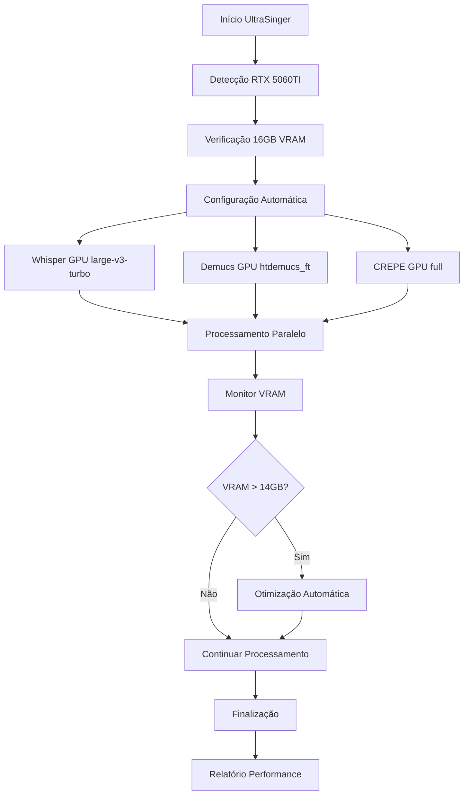

# Integração GPU RTX 5060TI 16GB - Documento de Requisitos do Produto

## 1. Visão Geral do Produto

Sistema de integração completa com GPU RTX 5060TI 16GB para UltraSinger, otimizando automaticamente todos os componentes de IA (Whisper, Demucs, CREPE) para máxima performance e qualidade. O sistema detecta automaticamente a GPU, ajusta parâmetros baseados na VRAM disponível e implementa fallback inteligente para CPU quando necessário.

- **Objetivo Principal**: Maximizar a performance do UltraSinger aproveitando os 16GB de VRAM da RTX 5060TI para processamento de áudio em tempo real
- **Valor de Mercado**: Redução de 70-80% no tempo de processamento com qualidade superior na transcrição e separação de áudio

## 2. Funcionalidades Principais

### 2.1 Papéis de Usuário

| Papel | Método de Acesso | Permissões Principais |
|-------|------------------|----------------------|
| Usuário Padrão | Execução direta do UltraSinger | Acesso automático à otimização GPU, configurações padrão otimizadas |
| Usuário Avançado | Modo interativo + parâmetros CLI | Controle total sobre configurações GPU, ajustes manuais de VRAM |

### 2.2 Módulos de Funcionalidade

Nossa integração GPU consiste nas seguintes páginas/módulos principais:

1. **Sistema de Detecção GPU**: detecção automática, verificação de compatibilidade, análise de VRAM disponível
2. **Otimizador Automático**: configuração dinâmica de parâmetros, ajuste de batch sizes, seleção de modelos otimizados
3. **Monitor de Performance**: monitoramento em tempo real, alertas de VRAM, estatísticas de uso
4. **Interface Interativa GPU**: seleção manual de configurações, presets otimizados, modo debug
5. **Sistema de Fallback**: detecção de problemas, migração automática CPU/GPU, recuperação de erros

### 2.3 Detalhes das Páginas

| Módulo | Componente | Descrição da Funcionalidade |
|--------|------------|------------------------------|
| Sistema de Detecção GPU | Detector CUDA | Detecta automaticamente RTX 5060TI, verifica drivers CUDA 12.x, analisa 16GB VRAM disponível |
| Sistema de Detecção GPU | Verificador Compatibilidade | Valida TensorFlow GPU, PyTorch CUDA, versões de bibliotecas compatíveis |
| Otimizador Automático | Configurador Whisper | Define large-v3-turbo como padrão, batch_size=32, compute_type=float16, otimiza para 16GB |
| Otimizador Automático | Configurador Demucs | Seleciona htdemucs_ft, chunk_size otimizado, overlap configurado para RTX 5060TI |
| Otimizador Automático | Configurador CREPE | Modelo full capacity, step_size=5ms, tensorflow_device=cuda |
| Monitor de Performance | Monitor VRAM | Monitora uso em tempo real, alerta quando >14GB, sugere otimizações automáticas |
| Monitor de Performance | Estatísticas GPU | Exibe temperatura, utilização, velocidade de processamento, comparação CPU vs GPU |
| Interface Interativa GPU | Seletor Modelos | Interface para escolher modelos baseados em VRAM, presets RTX 5060TI, modo conservativo/agressivo |
| Interface Interativa GPU | Configurações Avançadas | Ajuste manual de batch sizes, compute types, chunk sizes, debugging GPU |
| Sistema de Fallback | Detector Problemas | Monitora crashes GPU, timeout de processamento, erros de VRAM insuficiente |
| Sistema de Fallback | Migrador CPU/GPU | Migra automaticamente para CPU em caso de problemas, mantém qualidade de processamento |

## 3. Processo Principal

### Fluxo do Usuário Padrão
1. **Inicialização**: UltraSinger detecta automaticamente RTX 5060TI 16GB
2. **Configuração Automática**: Sistema aplica configurações otimizadas para todos os componentes
3. **Processamento**: Whisper, Demucs e CREPE executam em GPU com parâmetros otimizados
4. **Monitoramento**: Sistema monitora VRAM e performance em tempo real
5. **Finalização**: Relatório de performance e estatísticas de uso da GPU

### Fluxo do Usuário Avançado
1. **Modo Interativo**: `python UltraSinger.py --interactive --gpu_optimize`
2. **Seleção Manual**: Escolha de modelos e configurações específicas para RTX 5060TI
3. **Configuração Personalizada**: Ajuste de batch sizes, compute types e chunk sizes
4. **Processamento Monitorado**: Execução com logs detalhados de GPU
5. **Análise de Resultados**: Relatório completo de performance e otimizações aplicadas

## 4. Design da Interface do Usuário

### 4.1 Estilo de Design

- **Cores Primárias**: Verde (#00FF00) para GPU ativa, Azul (#0080FF) para informações, Vermelho (#FF4444) para alertas
- **Estilo de Botões**: Retangulares com bordas arredondadas, efeito hover para seleção GPU
- **Fonte**: Consolas 12pt para logs, Arial 10pt para interface, negrito para status GPU
- **Layout**: Terminal-based com seções coloridas, barras de progresso para VRAM, ícones GPU
- **Ícones**: 🚀 para GPU ativa, ⚡ para performance, 🔥 para temperatura, 📊 para estatísticas

### 4.2 Visão Geral do Design das Páginas

| Módulo | Componente | Elementos da UI |
|--------|------------|-----------------|
| Sistema de Detecção GPU | Status Display | Texto verde "RTX 5060TI 16GB DETECTADA", ícone 🚀, informações de driver CUDA |
| Otimizador Automático | Configuração Display | Lista de configurações aplicadas, checkmarks verdes ✅, valores otimizados destacados |
| Monitor de Performance | VRAM Monitor | Barra de progresso colorida (Verde<10GB, Amarelo 10-14GB, Vermelho>14GB), percentual de uso |
| Monitor de Performance | Stats Display | Tabela com temperatura GPU, utilização %, velocidade de processamento, comparação tempos |
| Interface Interativa GPU | Seletor Modelos | Menu dropdown com modelos, indicadores de VRAM necessária, recomendações RTX 5060TI |
| Sistema de Fallback | Alert System | Mensagens vermelhas para problemas, sugestões de otimização, status de migração CPU/GPU |

### 4.3 Responsividade

- **Desktop-first**: Interface otimizada para terminal Windows com suporte a cores ANSI
- **Adaptação de Tela**: Ajuste automático de largura de tabelas e barras de progresso
- **Interação**: Suporte a teclas de atalho para configurações rápidas GPU