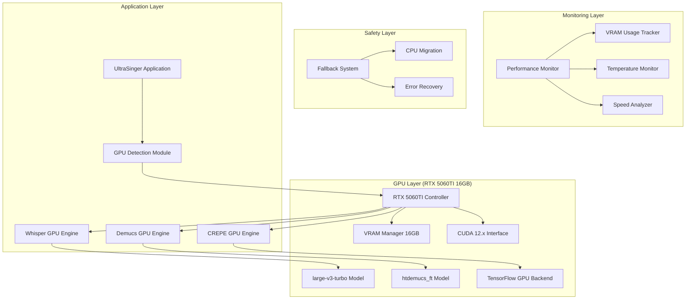
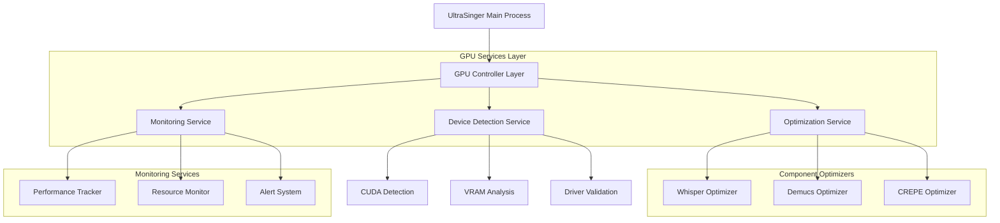
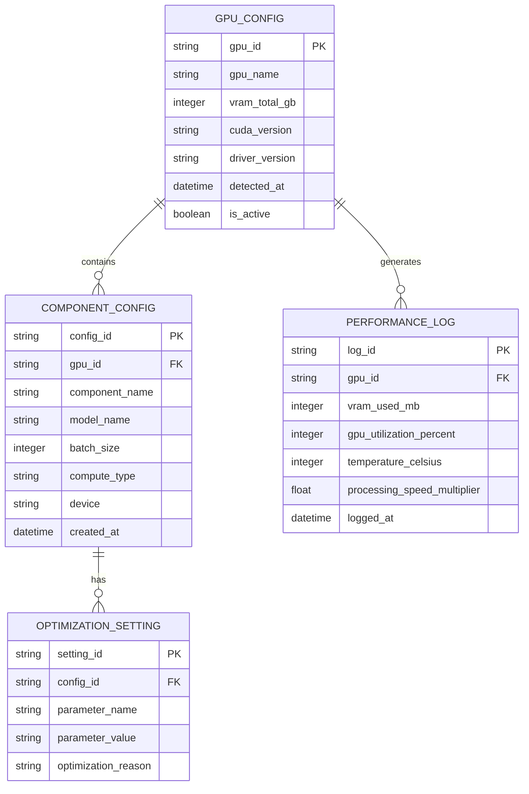

# Arquitetura Técnica - Integração GPU RTX 5060TI 16GB

## 1. Design da Arquitetura



## 2. Descrição das Tecnologias

- **Frontend**: Terminal Interface com Python 3.10 + colorama + rich
- **Backend**: UltraSinger Core + GPU Optimization Layer
- **GPU Framework**: CUDA 12.x + cuDNN 8.x + TensorFlow-GPU 2.10 + PyTorch 2.0+
- **Monitoring**: psutil + nvidia-ml-py + GPUtil
- **Models**: Whisper large-v3-turbo + Demucs htdemucs_ft + CREPE full

## 3. Definições de Rotas

| Rota | Propósito |
|------|-----------|
| /gpu/detect | Detecta e valida RTX 5060TI, verifica VRAM e drivers CUDA |
| /gpu/optimize | Aplica configurações otimizadas baseadas em 16GB VRAM |
| /gpu/monitor | Monitora uso de VRAM, temperatura e performance em tempo real |
| /gpu/whisper | Configura Whisper para GPU com large-v3-turbo otimizado |
| /gpu/demucs | Configura Demucs para GPU com htdemucs_ft e chunk sizes otimizados |
| /gpu/crepe | Configura CREPE para GPU com TensorFlow backend otimizado |
| /gpu/fallback | Sistema de migração automática CPU/GPU em caso de problemas |
| /gpu/stats | Relatório de performance e estatísticas de uso da GPU |

## 4. Definições de API

### 4.1 Core GPU API

**Detecção e Configuração GPU**
```
POST /api/gpu/initialize
```

Request:
| Nome do Parâmetro | Tipo | Obrigatório | Descrição |
|-------------------|------|-------------|-----------|
| force_detection | boolean | false | Força nova detecção mesmo com cache válido |
| optimization_mode | string | false | "conservative", "balanced", "aggressive" |
| vram_limit | integer | false | Limite manual de VRAM em GB (padrão: auto-detect) |

Response:
| Nome do Parâmetro | Tipo | Descrição |
|-------------------|------|-----------|
| gpu_detected | boolean | RTX 5060TI detectada com sucesso |
| vram_total | integer | Total de VRAM disponível em GB |
| cuda_version | string | Versão do CUDA detectada |
| optimization_applied | object | Configurações aplicadas para cada componente |

Exemplo:
```json
{
  "gpu_detected": true,
  "vram_total": 16,
  "cuda_version": "12.2",
  "optimization_applied": {
    "whisper": {
      "model": "large-v3-turbo",
      "batch_size": 32,
      "compute_type": "float16"
    },
    "demucs": {
      "model": "htdemucs_ft",
      "chunk_size": 262144,
      "overlap": 0.25
    },
    "crepe": {
      "model_capacity": "full",
      "step_size": 5,
      "device": "cuda"
    }
  }
}
```

**Monitoramento de Performance**
```
GET /api/gpu/monitor
```

Response:
| Nome do Parâmetro | Tipo | Descrição |
|-------------------|------|-----------|
| vram_used | integer | VRAM utilizada em MB |
| vram_free | integer | VRAM livre em MB |
| gpu_utilization | integer | Utilização da GPU em % |
| temperature | integer | Temperatura da GPU em °C |
| processing_speed | float | Velocidade de processamento (x tempo real) |

**Configuração de Componentes**
```
POST /api/gpu/configure_component
```

Request:
| Nome do Parâmetro | Tipo | Obrigatório | Descrição |
|-------------------|------|-------------|-----------|
| component | string | true | "whisper", "demucs", "crepe" |
| model | string | false | Modelo específico a usar |
| batch_size | integer | false | Tamanho do batch para processamento |
| device_override | string | false | "cuda", "cpu" para forçar dispositivo |

## 5. Diagrama da Arquitetura do Servidor



## 6. Modelo de Dados

### 6.1 Definição do Modelo de Dados



### 6.2 Linguagem de Definição de Dados

**Tabela de Configuração GPU (gpu_config)**
```sql
-- Criar tabela
CREATE TABLE gpu_config (
    gpu_id VARCHAR(50) PRIMARY KEY,
    gpu_name VARCHAR(100) NOT NULL,
    vram_total_gb INTEGER NOT NULL,
    cuda_version VARCHAR(20),
    driver_version VARCHAR(50),
    detected_at TIMESTAMP DEFAULT CURRENT_TIMESTAMP,
    is_active BOOLEAN DEFAULT TRUE
);

-- Criar índices
CREATE INDEX idx_gpu_config_active ON gpu_config(is_active);
CREATE INDEX idx_gpu_config_detected ON gpu_config(detected_at DESC);

-- Dados iniciais
INSERT INTO gpu_config (gpu_id, gpu_name, vram_total_gb, cuda_version, driver_version)
VALUES ('rtx5060ti-16gb-001', 'NVIDIA GeForce RTX 5060 Ti', 16, '12.2', '546.33');
```

**Tabela de Configuração de Componentes (component_config)**
```sql
-- Criar tabela
CREATE TABLE component_config (
    config_id VARCHAR(50) PRIMARY KEY,
    gpu_id VARCHAR(50) REFERENCES gpu_config(gpu_id),
    component_name VARCHAR(50) NOT NULL,
    model_name VARCHAR(100),
    batch_size INTEGER,
    compute_type VARCHAR(20),
    device VARCHAR(10),
    created_at TIMESTAMP DEFAULT CURRENT_TIMESTAMP
);

-- Criar índices
CREATE INDEX idx_component_config_gpu ON component_config(gpu_id);
CREATE INDEX idx_component_config_component ON component_config(component_name);

-- Dados iniciais otimizados para RTX 5060TI 16GB
INSERT INTO component_config (config_id, gpu_id, component_name, model_name, batch_size, compute_type, device)
VALUES 
    ('whisper-rtx5060ti-opt', 'rtx5060ti-16gb-001', 'whisper', 'large-v3-turbo', 32, 'float16', 'cuda'),
    ('demucs-rtx5060ti-opt', 'rtx5060ti-16gb-001', 'demucs', 'htdemucs_ft', 4, 'float32', 'cuda'),
    ('crepe-rtx5060ti-opt', 'rtx5060ti-16gb-001', 'crepe', 'full', 1, 'float32', 'cuda');
```

**Tabela de Log de Performance (performance_log)**
```sql
-- Criar tabela
CREATE TABLE performance_log (
    log_id VARCHAR(50) PRIMARY KEY,
    gpu_id VARCHAR(50) REFERENCES gpu_config(gpu_id),
    vram_used_mb INTEGER,
    gpu_utilization_percent INTEGER,
    temperature_celsius INTEGER,
    processing_speed_multiplier FLOAT,
    logged_at TIMESTAMP DEFAULT CURRENT_TIMESTAMP
);

-- Criar índices
CREATE INDEX idx_performance_log_gpu ON performance_log(gpu_id);
CREATE INDEX idx_performance_log_time ON performance_log(logged_at DESC);
CREATE INDEX idx_performance_log_vram ON performance_log(vram_used_mb DESC);
```