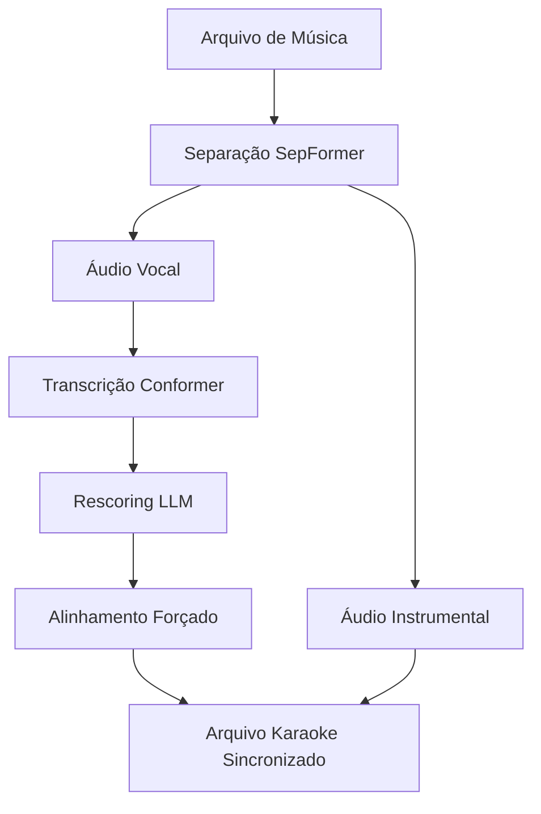

# Integração SpeechBrain 1.0 para UltraSinger - Requisitos do Produto

## 1. Visão Geral do Produto

O UltraSinger é uma ferramenta especializada em separação de áudio e geração de letras sincronizadas para karaoke. A integração com SpeechBrain 1.0 visa aprimorar significativamente a qualidade da separação vocal/instrumental e a precisão das transcrições sincronizadas.

- **Objetivo Principal**: Melhorar a qualidade da separação de áudio e precisão das letras sincronizadas usando os modelos mais avançados do SpeechBrain 1.0
- **Público-Alvo**: Usuários que criam arquivos de karaoke (.kar, .cdg, UltraStar) a partir de músicas originais
- **Valor de Mercado**: Ferramenta profissional para criação de conteúdo de karaoke com qualidade superior

## 2. Funcionalidades Principais

### 2.1 Papéis de Usuário
Não aplicável - ferramenta de uso individual sem distinção de papéis.

### 2.2 Módulos de Funcionalidade

Nossa integração com SpeechBrain 1.0 consiste nas seguintes melhorias principais:

1. **Separação de Áudio Avançada**: Modelos SepFormer aprimorados, separação vocal/instrumental de alta qualidade, processamento otimizado.
2. **Reconhecimento de Fala para Karaoke**: Transcrição precisa com modelos Conformer, rescoring com LLM, suporte multilíngue.
3. **Sincronização Temporal**: Alinhamento forçado, detecção de atividade vocal (VAD), timestamps precisos.
4. **Sistema de Configuração**: Seleção de modelos, configurações por idioma, otimizações de performance.

### 2.3 Detalhes das Páginas

| Módulo | Componente | Descrição da Funcionalidade |
|--------|------------|----------------------------|
| Separação de Áudio | SepFormer Avançado | Implementar modelos SepFormer mais recentes para separação vocal/instrumental superior. Suporte para processamento em lote e tempo real. |
| Separação de Áudio | Otimização de Performance | Configurações automáticas baseadas no hardware disponível (CPU/GPU). Cache inteligente de modelos. |
| ASR para Karaoke | Modelos Conformer | Integrar modelos Conformer/Branchformer para transcrição mais precisa. Suporte para múltiplos idiomas. |
| ASR para Karaoke | Rescoring com LLM | Sistema de rescoring usando modelos de linguagem para melhorar precisão das letras transcritas. |
| Sincronização | Alinhamento Forçado | Implementar alinhamento forçado para sincronização precisa entre áudio e texto. |
| Sincronização | VAD Melhorado | Detecção de atividade vocal aprimorada para segmentação precisa. |
| Configuração | Seletor de Modelos | Interface para seleção de modelos específicos por tarefa e idioma. |
| Configuração | Gerenciamento de Cache | Sistema de cache inteligente para modelos pré-treinados. |

## 3. Processo Principal

### Fluxo de Processamento de Karaoke:

1. **Entrada de Áudio**: Usuário fornece arquivo de música original
2. **Separação de Áudio**: Sistema usa SepFormer para separar vocal/instrumental
3. **Transcrição**: Modelo Conformer transcreve a parte vocal
4. **Rescoring**: LLM melhora a precisão das letras
5. **Alinhamento**: Sistema alinha letras com timestamps precisos
6. **Exportação**: Gera arquivo de karaoke sincronizado

## 4. Design da Interface

### 4.1 Estilo de Design
- **Cores Primárias**: Azul (#2563eb), Verde (#16a34a) para sucesso
- **Cores Secundárias**: Cinza (#64748b) para elementos neutros
- **Estilo de Botões**: Arredondados com sombra sutil
- **Fonte**: Inter, tamanhos 14px (corpo), 18px (títulos)
- **Layout**: Interface de linha de comando com feedback visual claro
- **Ícones**: Símbolos musicais (♪, ♫) e indicadores de progresso

### 4.2 Visão Geral do Design

| Módulo | Componente | Elementos de UI |
|--------|------------|-----------------|
| Separação de Áudio | Configuração SepFormer | Seletor de modelo, barra de progresso, indicadores de qualidade de separação |
| ASR para Karaoke | Configuração Conformer | Seletor de idioma, modelo ASR, configurações de rescoring |
| Sincronização | Alinhamento | Visualização de timeline, ajustes de precisão, preview de sincronização |
| Configuração | Gerenciamento | Lista de modelos disponíveis, status de download, configurações de cache |

### 4.3 Responsividade
Interface de linha de comando otimizada para terminal, com suporte para diferentes resoluções de tela e feedback visual adaptativo.