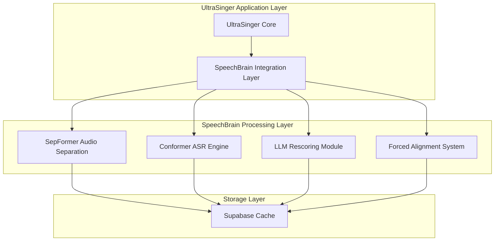
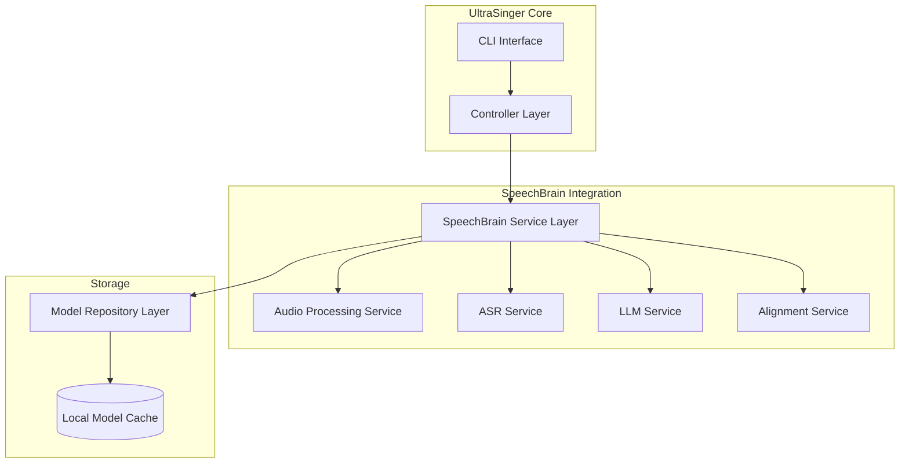
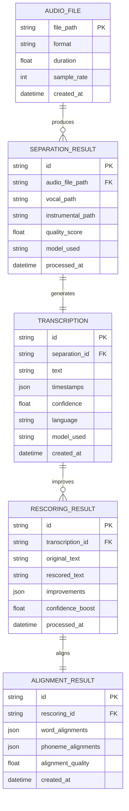

# Arquitetura Técnica - Integração SpeechBrain 1.0 no UltraSinger

## 1. Design da Arquitetura



## 2. Descrição das Tecnologias

- **Frontend**: Interface CLI existente do UltraSinger
- **Backend**: Python 3.10+ com SpeechBrain 1.0.3
- **Processamento**: PyTorch 2.0+ com CUDA (opcional)
- **Cache**: Sistema de cache local para modelos pré-treinados
- **Áudio**: librosa, soundfile, ffmpeg

## 3. Definições de Rotas

| Módulo | Propósito |
|--------|-----------|
| `/audio_separation` | Processamento de separação vocal/instrumental usando SepFormer |
| `/asr_transcription` | Transcrição de áudio usando modelos Conformer |
| `/llm_rescoring` | Rescoring de transcrições usando modelos de linguagem |
| `/forced_alignment` | Alinhamento forçado para sincronização precisa |
| `/model_management` | Gerenciamento e cache de modelos SpeechBrain |

## 4. Definições de API

### 4.1 API Principal de Separação de Áudio

**Separação SepFormer**
```
POST /api/audio/separate
```

Request:
| Parâmetro | Tipo | Obrigatório | Descrição |
|-----------|------|-------------|-----------|
| audio_file | string | true | Caminho para o arquivo de áudio |
| model_name | string | false | Modelo SepFormer específico (padrão: sepformer-wsj02mix) |
| output_format | string | false | Formato de saída (wav, flac) |

Response:
| Parâmetro | Tipo | Descrição |
|-----------|------|-----------|
| vocal_path | string | Caminho para o áudio vocal separado |
| instrumental_path | string | Caminho para o áudio instrumental |
| separation_quality | float | Métrica de qualidade da separação (0-1) |

**Transcrição ASR**
```
POST /api/asr/transcribe
```

Request:
| Parâmetro | Tipo | Obrigatório | Descrição |
|-----------|------|-------------|-----------|
| audio_file | string | true | Caminho para o arquivo de áudio vocal |
| language | string | false | Código do idioma (auto-detectado se não especificado) |
| model_type | string | false | Tipo de modelo (conformer, branchformer) |

Response:
| Parâmetro | Tipo | Descrição |
|-----------|------|-----------|
| transcription | string | Texto transcrito |
| timestamps | array | Array de timestamps para cada palavra |
| confidence | float | Confiança média da transcrição |

**Rescoring com LLM**
```
POST /api/llm/rescore
```

Request:
| Parâmetro | Tipo | Obrigatório | Descrição |
|-----------|------|-------------|-----------|
| transcription | string | true | Texto transcrito original |
| language | string | true | Idioma do texto |
| context | string | false | Contexto adicional (gênero musical, artista) |

Response:
| Parâmetro | Tipo | Descrição |
|-----------|------|-----------|
| rescored_text | string | Texto corrigido pelo LLM |
| improvements | array | Lista de correções realizadas |
| confidence_boost | float | Melhoria na confiança |

## 5. Arquitetura do Servidor



## 6. Modelo de Dados

### 6.1 Definição do Modelo de Dados



### 6.2 Linguagem de Definição de Dados

**Tabela de Arquivos de Áudio (audio_files)**
```sql
-- Criar tabela
CREATE TABLE audio_files (
    file_path VARCHAR(500) PRIMARY KEY,
    format VARCHAR(10) NOT NULL,
    duration FLOAT NOT NULL,
    sample_rate INTEGER NOT NULL,
    created_at TIMESTAMP DEFAULT CURRENT_TIMESTAMP
);

-- Criar índices
CREATE INDEX idx_audio_files_format ON audio_files(format);
CREATE INDEX idx_audio_files_duration ON audio_files(duration);
```

**Tabela de Resultados de Separação (separation_results)**
```sql
-- Criar tabela
CREATE TABLE separation_results (
    id VARCHAR(36) PRIMARY KEY DEFAULT (lower(hex(randomblob(16)))),
    audio_file_path VARCHAR(500) NOT NULL,
    vocal_path VARCHAR(500) NOT NULL,
    instrumental_path VARCHAR(500) NOT NULL,
    quality_score FLOAT NOT NULL,
    model_used VARCHAR(100) NOT NULL,
    processed_at TIMESTAMP DEFAULT CURRENT_TIMESTAMP,
    FOREIGN KEY (audio_file_path) REFERENCES audio_files(file_path)
);

-- Criar índices
CREATE INDEX idx_separation_audio_file ON separation_results(audio_file_path);
CREATE INDEX idx_separation_quality ON separation_results(quality_score DESC);
```

**Tabela de Transcrições (transcriptions)**
```sql
-- Criar tabela
CREATE TABLE transcriptions (
    id VARCHAR(36) PRIMARY KEY DEFAULT (lower(hex(randomblob(16)))),
    separation_id VARCHAR(36) NOT NULL,
    text TEXT NOT NULL,
    timestamps JSON NOT NULL,
    confidence FLOAT NOT NULL,
    language VARCHAR(10) NOT NULL,
    model_used VARCHAR(100) NOT NULL,
    created_at TIMESTAMP DEFAULT CURRENT_TIMESTAMP,
    FOREIGN KEY (separation_id) REFERENCES separation_results(id)
);

-- Criar índices
CREATE INDEX idx_transcriptions_separation ON transcriptions(separation_id);
CREATE INDEX idx_transcriptions_language ON transcriptions(language);
CREATE INDEX idx_transcriptions_confidence ON transcriptions(confidence DESC);
```

**Dados Iniciais**
```sql
-- Configurações padrão de modelos
INSERT INTO model_configurations (model_type, model_name, language, default_config) VALUES
('sepformer', 'speechbrain/sepformer-wsj02mix', 'universal', '{"sample_rate": 8000, "chunk_length": 32000}'),
('conformer', 'speechbrain/asr-conformer-transformerlm-librispeech', 'en', '{"beam_size": 10, "lm_weight": 0.60}'),
('conformer', 'speechbrain/asr-conformer-commonvoice-pt', 'pt', '{"beam_size": 10, "lm_weight": 0.60}'),
('wav2vec2', 'speechbrain/asr-wav2vec2-commonvoice-en', 'en', '{"chunk_length": 30}');
```