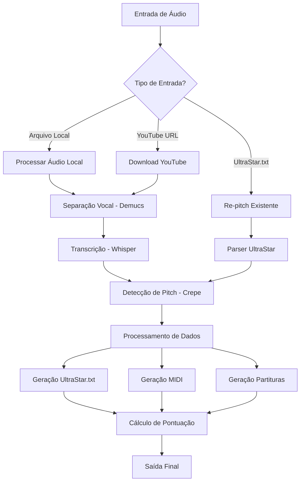

# Documento de Requisitos do Produto - UltraSinger

## 1. Visão Geral do Produto

O UltraSinger é uma ferramenta de inteligência artificial que automatiza a criação de arquivos UltraStar.txt, MIDI e partituras musicais a partir de áudio. Utiliza múltiplos modelos de IA para extrair texto da voz e determinar o pitch, criando automaticamente arquivos de karaokê UltraStar completos.

O produto resolve o problema manual e demorado de criar arquivos UltraStar, permitindo que criadores de conteúdo de karaokê gerem arquivos profissionais automaticamente. É direcionado para desenvolvedores de jogos de karaokê, criadores de conteúdo musical e entusiastas do UltraStar.

O objetivo é democratizar a criação de conteúdo UltraStar, reduzindo o tempo de produção de horas para minutos através de automação inteligente.

## 2. Funcionalidades Principais

### 2.1 Papéis de Usuário

| Papel | Método de Registro | Permissões Principais |
|-------|-------------------|----------------------|
| Usuário Básico | Instalação local do software | Pode processar arquivos de áudio locais, usar modelos básicos de IA |
| Usuário Avançado | Configuração com GPU CUDA | Pode usar modelos avançados, processamento acelerado, todas as funcionalidades |

### 2.2 Módulo de Funcionalidades

Nossos requisitos do UltraSinger consistem nas seguintes páginas principais:
1. **Interface de Linha de Comando**: entrada de parâmetros, seleção de modelos, configuração de saída
2. **Processamento de Áudio**: separação vocal, transcrição, detecção de pitch
3. **Geração de Arquivos**: criação UltraStar.txt, MIDI, partituras
4. **Modo Interativo**: configuração guiada, seleção de opções em tempo real

### 2.3 Detalhes das Páginas

| Nome da Página | Nome do Módulo | Descrição da Funcionalidade |
|----------------|----------------|----------------------------|
| Interface CLI | Parser de Argumentos | Processar argumentos de entrada (-i, -o), validar parâmetros, exibir ajuda e versão |
| Interface CLI | Modo Interativo | Permitir configuração guiada através de prompts, seleção de modelos, configuração de opções |
| Processamento de Áudio | Separação Vocal | Separar vocais do áudio usando Demucs (htdemucs, mdx, etc.), criar faixas isoladas |
| Processamento de Áudio | Transcrição | Transcrever áudio para texto usando Whisper (tiny, base, small, medium, large), detectar idioma |
| Processamento de Áudio | Detecção de Pitch | Detectar pitch usando Crepe (tiny, full), calcular notas musicais, sincronizar com texto |
| Processamento de Áudio | Processamento de Silêncio | Remover silêncios, detectar pausas respiratórias, otimizar segmentação |
| Geração de Arquivos | Criador UltraStar | Gerar arquivo .txt UltraStar com timing, pitch, texto, calcular pontuação |
| Geração de Arquivos | Gerador MIDI | Criar arquivos MIDI a partir de dados de pitch, exportar notas musicais |
| Geração de Arquivos | Criador de Partituras | Gerar partituras usando MuseScore, exportar em formatos padrão |
| Entrada de Dados | Processador de Áudio Local | Carregar arquivos MP3, WAV, converter formatos, validar entrada |
| Entrada de Dados | Downloader YouTube | Baixar áudio do YouTube usando yt-dlp, extrair metadados, processar cookies |
| Entrada de Dados | Parser UltraStar | Ler arquivos UltraStar existentes, re-pitch áudio, atualizar timing |

## 3. Processo Principal

### Fluxo do Usuário Básico:
1. Usuário executa comando com arquivo de áudio de entrada
2. Sistema processa áudio através de separação vocal
3. Transcrição automática do texto usando Whisper
4. Detecção de pitch usando Crepe
5. Geração de arquivos UltraStar.txt, MIDI e partituras
6. Cálculo de pontuação e validação final

### Fluxo do Usuário Avançado:
1. Usuário inicia modo interativo
2. Sistema apresenta opções de configuração
3. Seleção de modelos de IA e parâmetros
4. Processamento com configurações personalizadas
5. Geração de múltiplos formatos de saída
6. Análise detalhada e relatórios

## 4. Design da Interface do Usuário

### 4.1 Estilo de Design

- **Cores Primárias**: Verde (#00FF00) para sucesso, Vermelho (#FF0000) para erros, Azul (#0080FF) para informações
- **Estilo de Interface**: Interface de linha de comando com cores destacadas, texto formatado com rich/colorama
- **Fontes**: Fonte monoespaçada padrão do terminal, tamanhos variáveis para hierarquia
- **Layout**: Estrutura linear de comando, saída progressiva com barras de progresso
- **Ícones**: Emojis Unicode para status (✅ sucesso, ❌ erro, ⚠️ aviso, 🎵 música)

### 4.2 Visão Geral do Design da Página

| Nome da Página | Nome do Módulo | Elementos da UI |
|----------------|----------------|-----------------|
| Interface CLI | Cabeçalho Principal | Logo ASCII colorido, informações de versão, badges de status |
| Interface CLI | Parser de Comandos | Texto de ajuda formatado, exemplos de uso, validação de parâmetros |
| Processamento | Indicadores de Progresso | Barras de progresso coloridas, percentuais, tempo estimado |
| Processamento | Logs de Status | Mensagens categorizadas por cor, timestamps, níveis de verbosidade |
| Saída | Relatório Final | Tabelas formatadas, estatísticas de processamento, caminhos de arquivos |
| Modo Interativo | Menus de Seleção | Listas numeradas, validação de entrada, navegação por setas |

### 4.3 Responsividade

O produto é otimizado para terminais desktop com largura mínima de 80 caracteres. Suporta redimensionamento automático de tabelas e quebra de linha inteligente para diferentes tamanhos de terminal. Interface adaptável para Windows Command Prompt, PowerShell e terminais Unix.