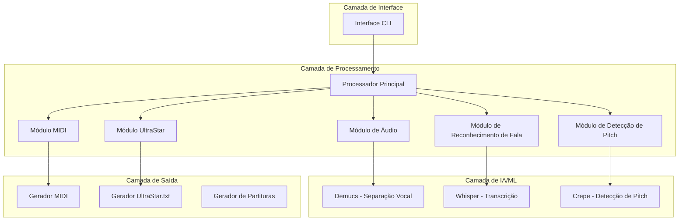
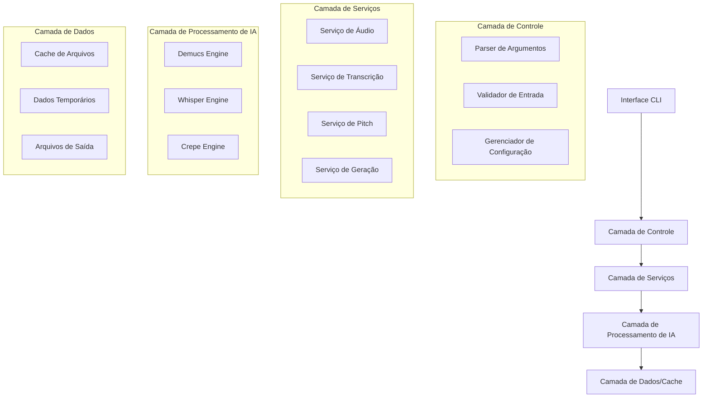
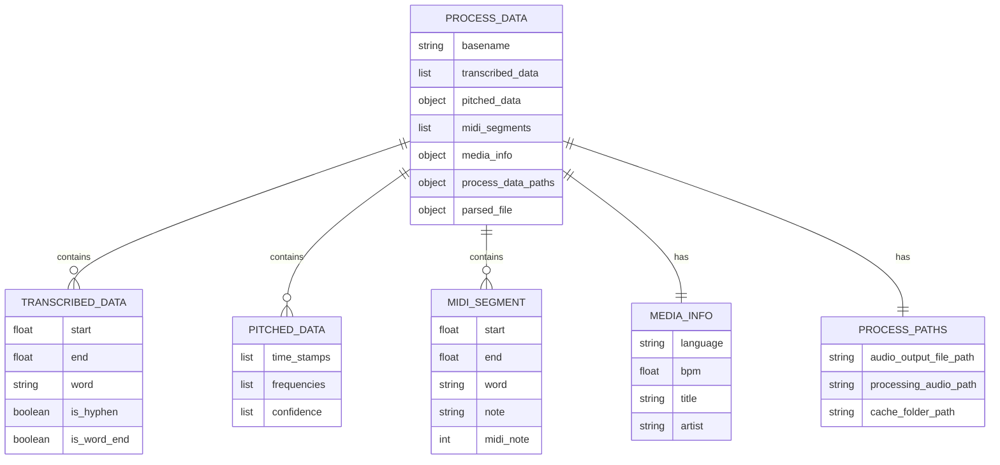

# Documento de Arquitetura Técnica - UltraSinger

## 1. Design da Arquitetura



## 2. Descrição da Tecnologia

- **Linguagem Principal**: Python 3.10
- **Frameworks de IA**: 
  - Whisper/WhisperX (transcrição de áudio)
  - Crepe (detecção de pitch)
  - Demucs (separação de áudio)
- **Processamento de Áudio**: 
  - librosa (análise de áudio)
  - torch/torchaudio (backend de IA)
  - ffmpeg (conversão de áudio)
- **Interface**: 
  - argparse (CLI)
  - rich/colorama (formatação de terminal)
- **Geração de Arquivos**:
  - music21 (processamento musical)
  - mido (geração MIDI)

## 3. Definições de Rotas

| Rota/Comando | Propósito |
|--------------|-----------|
| `python UltraSinger.py -i <audio>` | Processamento automático completo de arquivo de áudio |
| `python UltraSinger.py -i <youtube_url>` | Download e processamento de vídeo do YouTube |
| `python UltraSinger.py -i <ultrastar.txt>` | Re-pitch de arquivo UltraStar existente |
| `python UltraSinger.py --interactive` | Modo interativo com configuração guiada |
| `python UltraSinger.py -h` | Exibir ajuda e opções disponíveis |

## 4. Definições de API

### 4.1 API Principal de Processamento

**Função Principal de Execução**
```python
def run() -> tuple[str, Score, Score]
```

Parâmetros de Entrada:
| Nome do Parâmetro | Tipo | Obrigatório | Descrição |
|-------------------|------|-------------|-----------|
| input_file_path | string | true | Caminho do arquivo de áudio, URL do YouTube ou arquivo UltraStar.txt |
| output_folder_path | string | false | Pasta de saída para arquivos gerados |
| whisper_model | WhisperModel | false | Modelo Whisper (tiny, base, small, medium, large-v2) |
| crepe_model | string | false | Modelo Crepe (tiny, full) |
| demucs_model | DemucsModel | false | Modelo Demucs para separação vocal |

Resposta:
| Nome do Parâmetro | Tipo | Descrição |
|-------------------|------|-----------|
| ultrastar_file_path | string | Caminho do arquivo UltraStar.txt gerado |
| simple_score | Score | Pontuação simples calculada |
| accurate_score | Score | Pontuação precisa calculada |

### 4.2 API de Separação de Áudio

**Separação Vocal com Demucs**
```python
def separate_vocal_from_audio(cache_folder_path: str, audio_output_file_path: str, use_separated_vocal: bool, create_karaoke: bool, pytorch_device: str, model: DemucsModel) -> str
```

Parâmetros:
| Nome do Parâmetro | Tipo | Obrigatório | Descrição |
|-------------------|------|-------------|-----------|
| cache_folder_path | string | true | Pasta de cache para arquivos temporários |
| audio_output_file_path | string | true | Caminho do arquivo de áudio de entrada |
| use_separated_vocal | boolean | true | Se deve usar vocal separado |
| create_karaoke | boolean | true | Se deve criar versão karaokê |
| pytorch_device | string | true | Dispositivo PyTorch (cpu/cuda) |
| model | DemucsModel | true | Modelo Demucs a ser usado |

### 4.3 API de Transcrição

**Transcrição com Whisper**
```python
def transcribe_with_whisper(audio_path: str, model: WhisperModel, device: str, alignment_model: str, batch_size: int, compute_type: str, language: str, keep_numbers: bool) -> TranscriptionResult
```

Parâmetros:
| Nome do Parâmetro | Tipo | Obrigatório | Descrição |
|-------------------|------|-------------|-----------|
| audio_path | string | true | Caminho do arquivo de áudio |
| model | WhisperModel | true | Modelo Whisper a ser usado |
| device | string | false | Dispositivo de processamento (cpu/cuda) |
| language | string | false | Código do idioma (en, pt, es, etc.) |
| batch_size | integer | false | Tamanho do batch para processamento |

## 5. Diagrama da Arquitetura do Servidor



## 6. Modelo de Dados

### 6.1 Definição do Modelo de Dados



### 6.2 Estruturas de Dados Principais

**Classe ProcessData**
```python
class ProcessData:
    def __init__(self):
        self.basename: str = ""
        self.transcribed_data: list[TranscribedData] = []
        self.pitched_data: PitchedData = None
        self.midi_segments: list[MidiSegment] = []
        self.media_info: MediaInfo = MediaInfo()
        self.process_data_paths: ProcessDataPaths = ProcessDataPaths()
        self.parsed_file = None
```

**Classe TranscribedData**
```python
class TranscribedData:
    def __init__(self):
        self.start: float = 0.0
        self.end: float = 0.0
        self.word: str = ""
        self.is_hyphen: bool = False
        self.is_word_end: bool = True
```

**Classe MidiSegment**
```python
class MidiSegment:
    def __init__(self):
        self.start: float = 0.0
        self.end: float = 0.0
        self.word: str = ""
        self.note: str = ""
        self.midi_note: int = 0
```

**Enumerações de Modelos**
```python
class WhisperModel(Enum):
    TINY = "tiny"
    BASE = "base"
    SMALL = "small"
    MEDIUM = "medium"
    LARGE_V2 = "large-v2"
    LARGE_V3 = "large-v3"

class DemucsModel(Enum):
    HTDEMUCS = "htdemucs"
    HTDEMUCS_FT = "htdemucs_ft"
    MDX = "mdx"
    MDX_EXTRA = "mdx_extra"
```

**Configurações do Sistema**
```python
class Settings:
    def __init__(self):
        self.input_file_path: str = ""
        self.output_folder_path: str = "output"
        self.whisper_model: WhisperModel = WhisperModel.LARGE_V2
        self.crepe_model: str = "full"
        self.demucs_model: DemucsModel = DemucsModel.HTDEMUCS
        self.language: str = None
        self.device: str = "cpu"
        self.hyphenation: bool = True
        self.create_karaoke: bool = True
        self.create_midi: bool = True
        self.format_version: FormatVersion = FormatVersion.V1_2_0
```